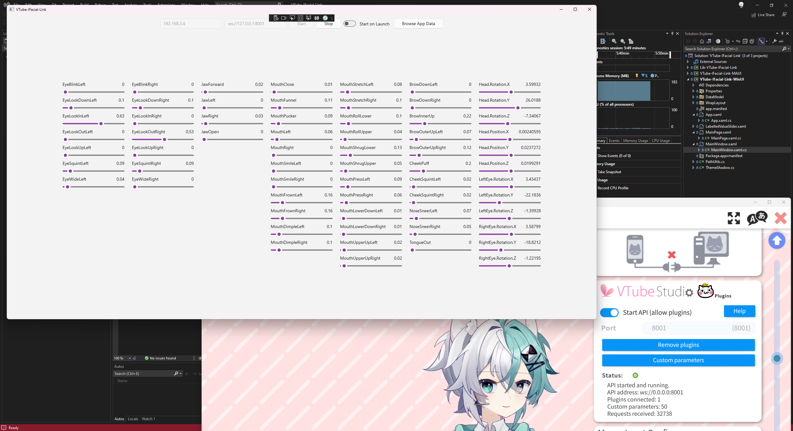

# VTube-IFacial-Link

一个 *VTube Studio* 插件，从 *iFacialMocap*（IOS）桥接面部跟踪，实现完整的苹果 ARKit 面部跟踪功能。

*这是一个使用 C# 实现的版本，另外还有一个[使用 Python 实现的版本](https://github.com/xuan25/VTube-IFacial-Link)*

## 快速开始指南

1. 从源码编译或下载预构建 VTube-IFacial-Link 可执行程序
2. 启动 Vtube Studio，并在设置中激活 VTube Studio API 功能
3. 将 iPhone 接入运行着 Vtube Studio 的主机所在的网络，并启动 iFacialMocap
4. 运行 VTube-IFacial-Link 可执行程序，并键入 捕捉设备的IP地址（iFacialMocap 中显示）以及 Vtube Studio 的 API 地址 (注意：用 127.0.0.1 替换任何 0.0.0.0，例如：ws://0.0.0.0:8001 -> ws://127.0.0.1:8001)
5. 点击 `Start` 按钮，此时 可以在窗口中看到捕获到的数据，同时 Vtube Studio 应检测到插件接入

## 支持的参数

### VTube Studio 预设

- FacePositionX
- FacePositionY
- FacePositionZ
- FaceAngleX
- FaceAngleY
- FaceAngleZ
- MouthSmile
- MouthOpen
- Brows
- TongueOut
- EyeOpenLeft
- EyeOpenRight
- EyeLeftX
- EyeLeftY
- EyeRightX
- EyeRightY
- CheekPuff
- FaceAngry
- BrowLeftY
- BrowRightY
- MouthX

### 自定义参数 (ARKit)

- EyeBlinkLeft
- EyeLookDownLeft
- EyeLookInLeft
- EyeLookOutLeft
- EyeLookUpLeft
- EyeSquintLeft
- EyeWideLeft
- EyeBlinkRight
- EyeLookDownRight
- EyeLookInRight
- EyeLookOutRight
- EyeLookUpRight
- EyeSquintRight
- EyeWideRight
- JawForward
- JawLeft
- JawRight
- JawOpen
- MouthClose
- MouthFunnel
- MouthPucker
- MouthLeft
- MouthRight
- MouthSmileLeft
- MouthSmileRight
- MouthFrownLeft
- MouthFrownRight
- MouthDimpleLeft
- MouthDimpleRight
- MouthStretchLeft
- MouthStretchRight
- MouthRollLower
- MouthRollUpper
- MouthShrugLower
- MouthShrugUpper
- MouthPressLeft
- MouthPressRight
- MouthLowerDownLeft
- MouthLowerDownRight
- MouthUpperUpLeft
- MouthUpperUpRight
- BrowDownLeft
- BrowDownRight
- BrowInnerUp
- BrowOuterUpLeft
- BrowOuterUpRight
- CheekPuff
- CheekSquintLeft
- CheekSquintRight
- NoseSneerLeft
- NoseSneerRight
- TongueOut

## 致谢

截图中的模型是由 [Yuri幽里_official](https://www.bilibili.com/video/BV1S8411H7zf/) 创建的。
