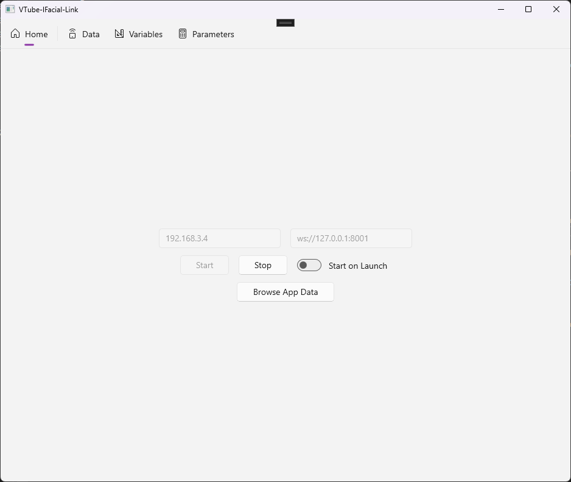
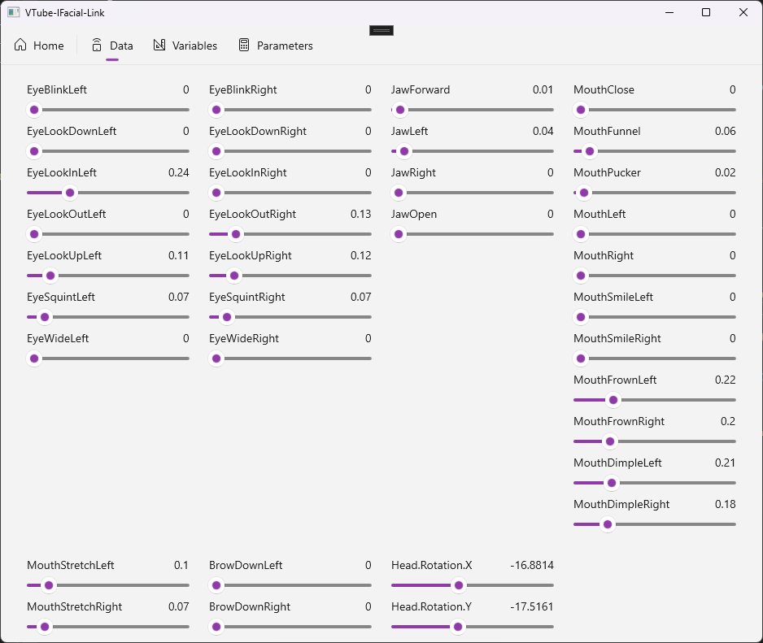
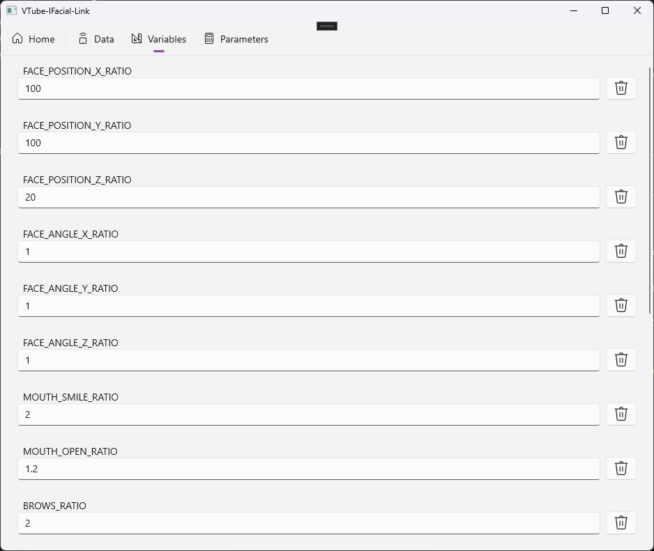
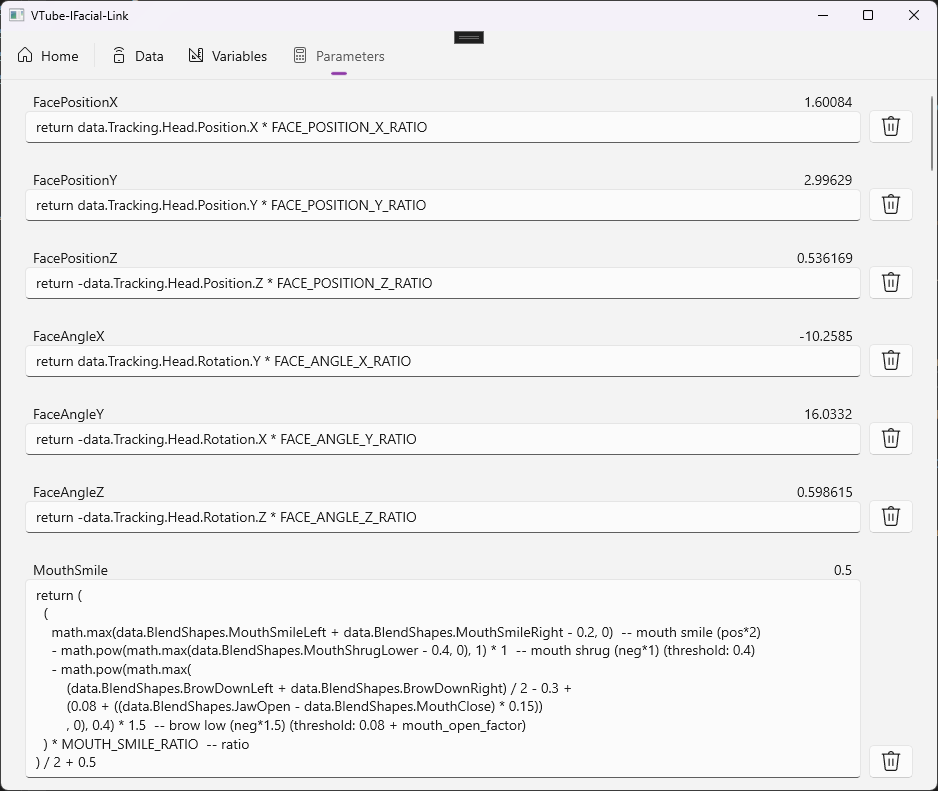

# VTube-IFacial-Link

[简体中文](./README-zh_CN.md)

A *VTube Studio* plugin that bridging facial tracking from *iFacialMocap* (IOS), enabling full apple ARKit facial tracking features.

*This is a version implemented in C#, there is also a [version implemented in Python](https://github.com/xuan25/VTube-IFacial-Link)*

|  |  |
| --- | --- |

## Scripting Support (Lua)

|  |  |
| --- | --- |

## Quick Start Guide

1. Compile from the source code or download the pre-built VTube-IFacial-Link executable 
2. Start Vtube Studio and activate the VTube Studio API feature in the settings
3. Connect your iPhone to the same network as the host where Vtube Studio is running and start iFacialMocap
4. Run the VTube-IFacial-Link executable and type in the IP address of the capturing device (shown in iFacialMocap) and the API address of Vtube Studio. (Note: replace any 0.0.0.0 with 127.0.0.1 e.g. ws://0.0.0.0:8001 -> ws://127.0.0.1:8001)
5. Click on the `Start` button and you will see the captured data in the window and Vtube Studio should detect the plugin

## Supported Parameters

### VTube Studio Default

- FacePositionX
- FacePositionY
- FacePositionZ
- FaceAngleX
- FaceAngleY
- FaceAngleZ
- MouthSmile
- MouthOpen
- Brows
- TongueOut
- EyeOpenLeft
- EyeOpenRight
- EyeLeftX
- EyeLeftY
- EyeRightX
- EyeRightY
- CheekPuff
- FaceAngry
- BrowLeftY
- BrowRightY
- MouthX

### Custom Parameters (ARKit)

- EyeBlinkLeft
- EyeLookDownLeft
- EyeLookInLeft
- EyeLookOutLeft
- EyeLookUpLeft
- EyeSquintLeft
- EyeWideLeft
- EyeBlinkRight
- EyeLookDownRight
- EyeLookInRight
- EyeLookOutRight
- EyeLookUpRight
- EyeSquintRight
- EyeWideRight
- JawForward
- JawLeft
- JawRight
- JawOpen
- MouthClose
- MouthFunnel
- MouthPucker
- MouthLeft
- MouthRight
- MouthSmileLeft
- MouthSmileRight
- MouthFrownLeft
- MouthFrownRight
- MouthDimpleLeft
- MouthDimpleRight
- MouthStretchLeft
- MouthStretchRight
- MouthRollLower
- MouthRollUpper
- MouthShrugLower
- MouthShrugUpper
- MouthPressLeft
- MouthPressRight
- MouthLowerDownLeft
- MouthLowerDownRight
- MouthUpperUpLeft
- MouthUpperUpRight
- BrowDownLeft
- BrowDownRight
- BrowInnerUp
- BrowOuterUpLeft
- BrowOuterUpRight
- CheekPuff
- CheekSquintLeft
- CheekSquintRight
- NoseSneerLeft
- NoseSneerRight
- TongueOut

## Acknowledgment

The model in the screenshot is created by [Yuri幽里_official](https://www.bilibili.com/video/BV1S8411H7zf/)
